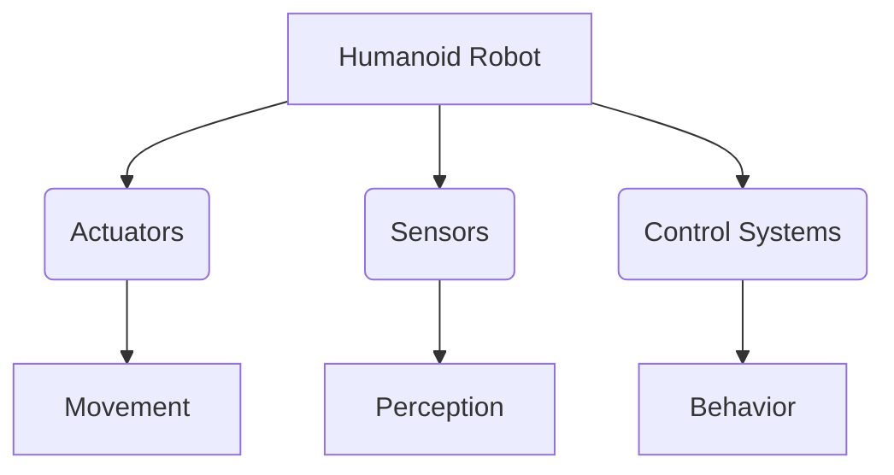

# Basics of Humanoid Robotics

Humanoid robotics is a fascinating branch of robotics focused on building robots that resemble and mimic human behavior. This chapter will cover the fundamental aspects of humanoid robot design, locomotion, manipulation, and sensing.

## Humanoid Robot Anatomy

- **Actuators**: Motors and mechanisms that enable movement.
- **Sensors**: Devices for perceiving the environment (cameras, force sensors, IMUs).
- **Control Systems**: Algorithms that govern robot behavior.

## Locomotion and Balance

Humanoid robots face unique challenges in bipedal locomotion and maintaining balance. We will explore:

- Kinematics and dynamics
- Gait generation
- Balance control strategies

## Manipulation and Interaction

- End-effectors (hands)
- Grasping and object manipulation
- Human-robot interaction interfaces

This chapter provides a foundational understanding of these complex systems.

